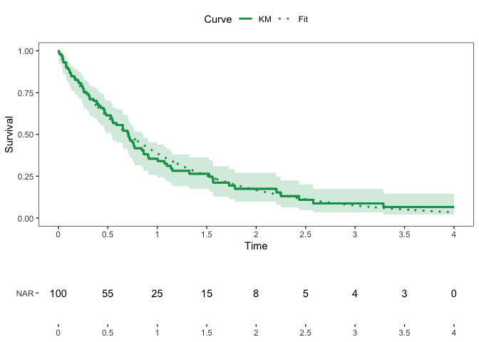
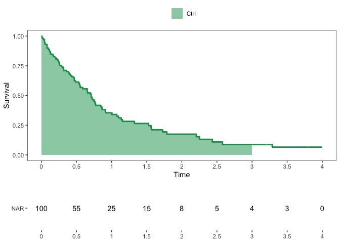
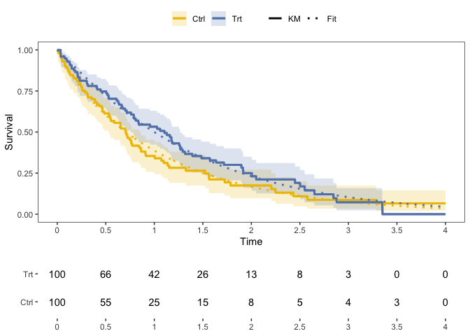

# Functions for Survival Analysis

Zachary R. McCaw <br>
Updated: 2022-08-07


```r
suppressPackageStartupMessages({
  library(dplyr)
  library(SurvUtils)
})
```

# Data Generation

Generates survival data with exponential event times and censoring. Optionally, the subject-specific event rate may depend on a set of covariates and/or a gamma-frailty.


```r
data <- SurvUtils::GenData(
  base_event_rate = 1.0,
  censoring_rate = 0.25,
  n = 100,
  tau = 4.0
)
head(data)
```

```
##   idx covariates true_event_rate frailty event_time censor_time      time
## 1   1          1               1       1  0.2161507    2.158832 0.2161507
## 2   2          1               1       1  0.7138938    1.885513 0.7138938
## 3   3          1               1       1  0.7785634    2.626152 0.7785634
## 4   4          1               1       1  2.3714006    1.384429 1.3844286
## 5   5          1               1       1  1.5034824    1.708774 1.5034824
## 6   6          1               1       1  2.3258316    1.479482 1.4794816
##   status
## 1      1
## 2      1
## 3      1
## 4      0
## 5      1
## 6      0
```

# Estimation

## One Sample

### Kaplan-Meier

* Tabulates the cumulative hazard and survival functions, along with variance estimates and confidence intervals.


```r
km_tab <- SurvUtils::TabulateKM(data)
head(km_tab)
```

```
## # A tibble: 6 × 13
##       time censor events   nar    haz cum_haz cum_haz_var cum_ha…¹ cum_h…²  surv
##      <dbl>  <dbl>  <dbl> <dbl>  <dbl>   <dbl>       <dbl>    <dbl>   <dbl> <dbl>
## 1 0             0      0   100 0       0         0         0        0      1    
## 2 0.000862      0      1   100 0.01    0.01      0.0001    0.00141  0.0710 0.99 
## 3 0.0331        0      1    99 0.0101  0.0201    0.000202  0.00503  0.0804 0.98 
## 4 0.0396        1      0    98 0       0.0201    0.000202  0.00503  0.0804 0.98 
## 5 0.0629        0      1    97 0.0103  0.0304    0.000308  0.00981  0.0943 0.970
## 6 0.0633        0      1    96 0.0104  0.0408    0.000417  0.0153   0.109  0.960
## # … with 3 more variables: surv_var <dbl>, surv_lower <dbl>, surv_upper <dbl>,
## #   and abbreviated variable names ¹​cum_haz_lower, ²​cum_haz_upper
## # ℹ Use `colnames()` to see all variable names
```

### Event Rate, Percentile, Restricted Mean Survival

* Calculate the event rate at a point in time.


```r
# Rate.
SurvUtils::OneSampleRates(data, tau = 1.0)
```

```
##   tau      rate         se    lower     upper
## 1   1 0.4269862 0.05213734 0.323885 0.5260347
```


```r
# Percentile: median.
SurvUtils::OneSamplePercentiles(data, p = 0.5)
```

```
##   prob      time     lower    upper
## 1  0.5 0.8498057 0.5703519 1.031601
```


```r
# RMST.
SurvUtils::OneSampleRMST(data, tau = 1.0)
```

```
##   tau       auc         se     lower     upper
## 1   1 0.6733513 0.03558384 0.6036082 0.7430943
```

## Two Sample

### Generate Data

```r
data0 <- SurvUtils::GenData(
  base_event_rate = 1.0,
  censoring_rate = 0.25,
  n = 100,
  tau = 4.0
)
data0$arm <- 0

data1 <- SurvUtils::GenData(
  base_event_rate = 0.5,
  censoring_rate = 0.25,
  n = 100,
  tau = 4.0
)
data1$arm <- 1
data <- rbind(data0, data1)
```

### Compare Rates

```r
SurvUtils::CompareRates(data, tau = 1.0)
```

```
## Marginal Statistics:
##   arm tau  rate     se
## 1   0   1 0.349 0.0498
## 2   1   1 0.592 0.0511
## 
## 
## Contrasts:
##   stat   est     se lower upper        p
## 1   rd 0.243 0.0714 0.103 0.383 0.000657
## 2   rr 1.700 0.2830 1.220 2.360 0.001530
## 3   or 2.710 0.8260 1.490 4.920 0.001080
```


```r
SurvUtils::CompareRMSTs(data, tau = 1.0)
```

```
## Marginal Statistics:
##   tau   auc     se lower upper arm
## 1   1 0.604 0.0368 0.532 0.676   0
## 2   1 0.763 0.0319 0.700 0.826   1
## 
## 
## Contrasts:
##   stat   est     se  lower upper       p
## 1   rd 0.159 0.0487 0.0632 0.254 0.00112
## 2   rr 1.260 0.0932 1.0900 1.460 0.00160
```

# Plotting


```r
# Generate data.
arm1 <- SurvUtils::GenData(base_event_rate = 0.8)
arm1$arm <- 1
arm0 <- SurvUtils::GenData(base_event_rate = 1.0)
arm0$arm <- 0
data <- rbind(arm1, arm0)
```

## One Sample

### Standard Kaplan-Meier


```r
x_breaks <- seq(from = 0.0, to = 4.0, by = 0.50)
data0 <- data %>% dplyr::filter(arm == 0)
fit0 <- Temporal::FitParaSurv(data0)
q_km <- SurvUtils::PlotOneSampleKM(data0, fit = fit0, x_breaks = x_breaks, x_max = 4)
q_nar <- SurvUtils::PlotOneSampleNARs(data0, x_breaks = x_breaks, x_max = 4)
cowplot::plot_grid(
  plotlist = list(q_km, q_nar),
  align = "v",
  axis = "l",
  ncol = 1,
  rel_heights = c(3, 1)
)
```



### AUC


```r
x_breaks <- seq(from = 0.0, to = 4.0, by = 0.50)
data0 <- data %>% dplyr::filter(arm == 0)
q_auc <- SurvUtils::PlotOneSampleAUC(data0, x_breaks = x_breaks, x_max = 4, tau = 3)
q_nar <- SurvUtils::PlotOneSampleNARs(data0, x_breaks = x_breaks, x_max = 4)
cowplot::plot_grid(
  plotlist = list(q_auc, q_nar),
  align = "v",
  axis = "l",
  ncol = 1,
  rel_heights = c(3, 1)
)
```



## Two Sample


```r
x_breaks <- seq(from = 0.0, to = 4.0, by = 0.50)
contrast <- Temporal::CompParaSurv(data)
q_km <- SurvUtils::PlotTwoSampleKM(data, contrast = contrast, x_breaks = x_breaks, x_max = 4)
q_nar <- SurvUtils::PlotTwoSampleNARs(data, x_breaks = x_breaks, x_max = 4)
cowplot::plot_grid(
  plotlist = list(q_km, q_nar),
  align = "v",
  axis = "l",
  ncol = 1,
  rel_heights = c(3, 1)
)
```


