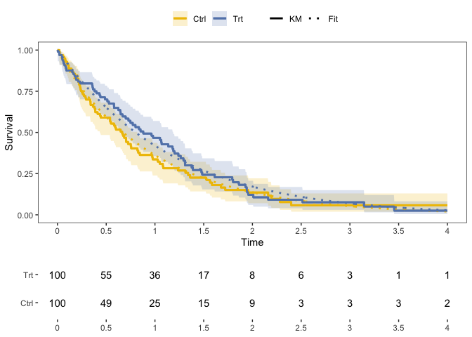

# Functions for Survival Analysis

Zachary R. McCaw <br>
Updated: 2023-09-26


```r
suppressPackageStartupMessages({
  library(dplyr)
  library(SurvUtils)
})
```

# Installation


```r
devtools::install_github(repo = "zrmacc/SurvUtils")
```

# Data Generation

Generates survival data with exponential event times and censoring. Optionally, the subject-specific event rate may depend on a set of covariates and/or a gamma-frailty.


```r
data <- SurvUtils::GenData(
  base_event_rate = 1.0,
  censoring_rate = 0.25,
  n = 100,
  tau = 4.0
)
head(data)
```

```
##   idx covariates true_event_rate frailty event_time censor_time      time
## 1   1          1               1       1  1.9034260  10.0879511 1.9034260
## 2   2          1               1       1  0.1031929   0.3953060 0.1031929
## 3   3          1               1       1  0.3290198   5.6795299 0.3290198
## 4   4          1               1       1  0.7635053   2.9790150 0.7635053
## 5   5          1               1       1  0.4515167   0.9243661 0.4515167
## 6   6          1               1       1  1.5540088   2.1998618 1.5540088
##   status
## 1      1
## 2      1
## 3      1
## 4      1
## 5      1
## 6      1
```

# Estimation

## One Sample

### Kaplan-Meier

* Tabulates the cumulative hazard and survival functions, along with variance estimates and confidence intervals.


```r
km_tab <- SurvUtils::TabulateKM(data)
head(km_tab)
```

```
## # A tibble: 6 × 13
##      time censor events   nar    haz cum_haz cum_haz_var cum_haz_lower
##     <dbl>  <dbl>  <dbl> <dbl>  <dbl>   <dbl>       <dbl>         <dbl>
## 1 0            0      0   100 0       0         0              0      
## 2 0.00708      0      1   100 0.01    0.01      0.0001         0.00141
## 3 0.0162       0      1    99 0.0101  0.0201    0.000202       0.00503
## 4 0.0168       0      1    98 0.0102  0.0303    0.000306       0.00977
## 5 0.0217       0      1    97 0.0103  0.0406    0.000412       0.0152 
## 6 0.0354       0      1    96 0.0104  0.0510    0.000521       0.0212 
## # ℹ 5 more variables: cum_haz_upper <dbl>, surv <dbl>, surv_var <dbl>,
## #   surv_lower <dbl>, surv_upper <dbl>
```

#### Influence function

The influence function expansion of the Kaplan-Meier estimator is:

$$
\sqrt{n}\big\{ \hat{S}(t) - S(t) \big\} = \frac{1}{\sqrt{n}}\sum_{i=1}^{n}\psi_{i}(t) + o_{p}(1)
$$
where:

$$
\psi_{i}(t) = -S(t) \int_{0}^{t}\frac{dM_{i}(u)}{n^{-1} Y(u)}
$$
and $dM_{i}$ is the counting-process martingale:

$$
dM_{i}(u) = dN_{i}(u) - Y_{i}(u)dH(u)
$$


```r
n <- 1000
data <- GenData(n = n)
tau <- 1.0

# Influence function calculation.
influence <- KMInfluence(data, tau = tau)

# Estimated variance of the KM estimator at time tau.
inf_var <- mean(influence^2) / n
inf_se <- sqrt(inf_var)
print(round(inf_se, digits = 4))
```

```
## [1] 0.0162
```

### Event Rate, Percentile, Restricted Mean Survival

* Calculate the event rate at a point in time.


```r
# Rate.
SurvUtils::OneSampleRates(data, tau = 1.0)
```

```
##   tau     rate         se     lower     upper
## 1   1 0.372035 0.01621849 0.3402719 0.4037691
```


```r
# Percentile: median.
SurvUtils::OneSamplePercentiles(data, p = 0.5)
```

```
##   prob      time     lower     upper
## 1  0.5 0.6959735 0.6356792 0.7725041
```


```r
# RMST.
SurvUtils::OneSampleRMST(data, tau = 1.0)
```

```
##   tau       auc         se     lower     upper
## 1   1 0.6311883 0.01172067 0.6082162 0.6541603
```

## Two Sample

### Generate Data

```r
data0 <- SurvUtils::GenData(
  base_event_rate = 1.0,
  censoring_rate = 0.25,
  n = 100,
  tau = 4.0
)
data0$arm <- 0

data1 <- SurvUtils::GenData(
  base_event_rate = 0.5,
  censoring_rate = 0.25,
  n = 100,
  tau = 4.0
)
data1$arm <- 1
data <- rbind(data0, data1)
```

### Compare Rates

```r
SurvUtils::CompareRates(data, tau = 1.0)
```

```
## Marginal Statistics:
##   arm tau  rate     se
## 1   0   1 0.428 0.0537
## 2   1   1 0.525 0.0528
## 
## 
## Contrasts:
##   stat    est     se   lower upper     p
## 1   rd 0.0962 0.0753 -0.0513 0.244 0.201
## 2   rr 1.2200 0.1970  0.8940 1.680 0.207
## 3   or 1.4700 0.4490  0.8100 2.680 0.204
```

### Compare RMSTs

```r
SurvUtils::CompareRMSTs(data, tau = 1.0)
```

```
## Marginal Statistics:
##   tau   auc     se lower upper arm
## 1   1 0.603 0.0384 0.528 0.679   0
## 2   1 0.742 0.0326 0.678 0.805   1
## 
## 
## Contrasts:
##   stat   est     se  lower upper       p
## 1   rd 0.138 0.0504 0.0395 0.237 0.00606
## 2   rr 1.230 0.0950 1.0600 1.430 0.00765
```

### Compare Cox Models
Compare the predictive performance of Cox models based on different sets of covariates with respect to their c-statistics on held-out data via k-fold cross validation.

```r
# Simulate data.
n <- 1000
x1 <- rnorm(n)
x2 <- rnorm(n)
data <- SurvUtils::GenData(
  covariates = cbind(x1, x2),
  beta_event = c(1.0, -1.0)
)

# Evaluate.
eval <- CompreCoxCstat(
  status = data$status,
  time = data$time,
  x1 = data %>% dplyr::select(x1, x2),
  x2 = data %>% dplyr::select(x1)
)

head(round(eval, digits = 3))
```

```
##   fold cstat1 cstat2  diff ratio
## 1    1  0.769  0.674 0.096 1.142
## 2    2  0.786  0.664 0.122 1.183
## 3    3  0.779  0.709 0.070 1.098
## 4    4  0.798  0.642 0.157 1.244
## 5    5  0.785  0.712 0.073 1.102
## 6    6  0.820  0.744 0.076 1.102
```

# Plotting


```r
# Generate data.
arm1 <- SurvUtils::GenData(base_event_rate = 0.8)
arm1$arm <- 1
arm0 <- SurvUtils::GenData(base_event_rate = 1.0)
arm0$arm <- 0
data <- rbind(arm1, arm0)
```

## One Sample

### Standard Kaplan-Meier


```r
x_breaks <- seq(from = 0.0, to = 4.0, by = 0.50)
data0 <- data %>% dplyr::filter(arm == 0)
fit0 <- Temporal::FitParaSurv(data0)  # Optional parametric fit. 
q_km <- SurvUtils::PlotOneSampleKM(data0, fit = fit0, x_breaks = x_breaks, x_max = 4)
q_nar <- SurvUtils::PlotOneSampleNARs(data0, x_breaks = x_breaks, x_max = 4)
cowplot::plot_grid(
  plotlist = list(q_km, q_nar),
  align = "v",
  axis = "l",
  ncol = 1,
  rel_heights = c(3, 1)
)
```


### AUC


```r
x_breaks <- seq(from = 0.0, to = 4.0, by = 0.50)
data0 <- data %>% dplyr::filter(arm == 0)
q_auc <- SurvUtils::PlotOneSampleAUC(data0, x_breaks = x_breaks, x_max = 4, tau = 3)
q_nar <- SurvUtils::PlotOneSampleNARs(data0, x_breaks = x_breaks, x_max = 4)
cowplot::plot_grid(
  plotlist = list(q_auc, q_nar),
  align = "v",
  axis = "l",
  ncol = 1,
  rel_heights = c(3, 1)
)
```


## Two Sample


```r
x_breaks <- seq(from = 0.0, to = 4.0, by = 0.50)
contrast <- Temporal::CompParaSurv(data)  # Optional parametric fit. 
q_km <- SurvUtils::PlotTwoSampleKM(data, contrast = contrast, x_breaks = x_breaks, x_max = 4)
q_nar <- SurvUtils::PlotTwoSampleNARs(data, x_breaks = x_breaks, x_max = 4)
cowplot::plot_grid(
  plotlist = list(q_km, q_nar),
  align = "v",
  axis = "l",
  ncol = 1,
  rel_heights = c(3, 1)
)
```


