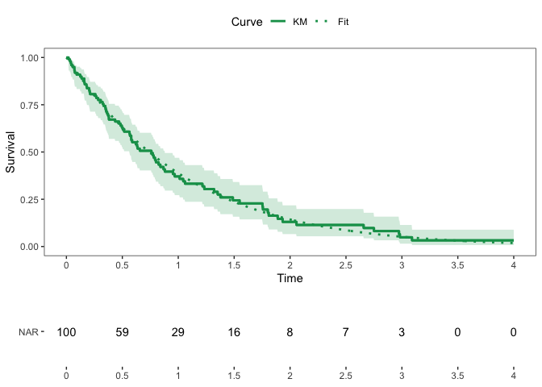
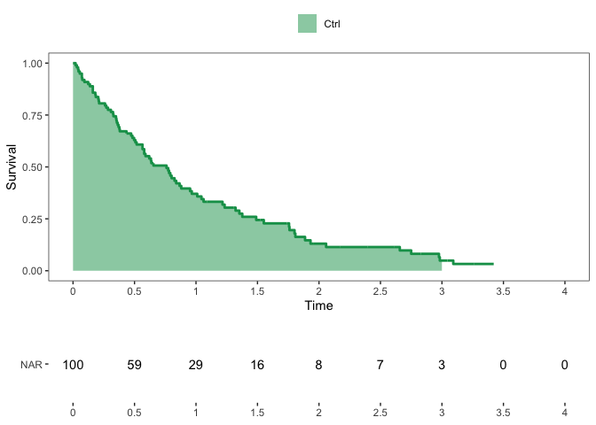
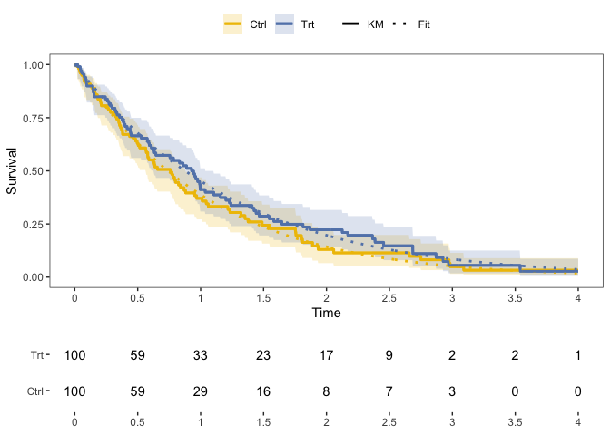

README
================
Zachary McCaw
2026-03-02

# Utility Functions for Survival Analysis

[](https://github.com/zrmacc/SurvUtils/actions/workflows/R-CMD-check.yaml)
[](https://doi.org/10.5281/zenodo.13927061)

Zachary R. McCaw <br> Updated: 2026-02-22

``` r
suppressPackageStartupMessages({
  library(dplyr)
  library(SurvUtils)
})
```

# Installation

``` r
devtools::install_github(repo = "zrmacc/SurvUtils")
```

# Data Generation

Generates survival data with exponential event times and censoring.
Optionally, the subject-specific event rate may depend on a set of
covariates and/or a gamma-frailty.

``` r
data <- SurvUtils::GenData(
  base_event_rate = 1.0,
  censoring_rate = 0.25,
  n = 100,
  tau = 4.0
)
head(data)
```

    ##   idx        time status
    ## 1   1 0.980409068      1
    ## 2   2 0.002987575      1
    ## 3   3 1.109346579      1
    ## 4   4 0.234960741      1
    ## 5   5 1.351709113      0
    ## 6   6 0.150846603      1

# Estimation

## One Sample

### Kaplan-Meier

- Tabulates the cumulative hazard and survival functions, along with
  variance estimates and confidence intervals.

``` r
km_tab <- SurvUtils::TabulateKM(data)
head(km_tab)
```

    ## # A tibble: 6 × 13
    ##      time censor events   nar    haz cum_haz cum_haz_var cum_haz_lower
    ##     <dbl>  <dbl>  <dbl> <dbl>  <dbl>   <dbl>       <dbl>         <dbl>
    ## 1 0            0      0   100 0       0         0              0      
    ## 2 0.00299      0      1   100 0.01    0.01      0.0001         0.00141
    ## 3 0.0409       0      1    99 0.0101  0.0201    0.000202       0.00503
    ## 4 0.0598       0      1    98 0.0102  0.0303    0.000306       0.00977
    ## 5 0.0598       0      1    97 0.0103  0.0406    0.000412       0.0152 
    ## 6 0.0601       0      1    96 0.0104  0.0510    0.000521       0.0212 
    ## # ℹ 5 more variables: cum_haz_upper <dbl>, surv <dbl>, surv_var <dbl>,
    ## #   surv_lower <dbl>, surv_upper <dbl>

### Event Rate, Percentile, Restricted Mean Survival

- Calculate the event rate at a point in time.

``` r
# Rate.
SurvUtils::OneSampleRates(data, tau = 1.0)
```

    ##   tau      rate         se     lower     upper
    ## 1   1 0.6509849 0.05069336 0.5521103 0.7483036

``` r
# Percentile: median.
SurvUtils::OneSamplePercentiles(data, p = 0.5)
```

    ##   prob      time     lower     upper
    ## 1  0.5 0.6068861 0.3464357 0.8500518

``` r
# RMST.
SurvUtils::OneSampleRMST(data, tau = 1.0)
```

    ##   tau       auc         se     lower     upper
    ## 1   1 0.5848973 0.03908704 0.5082881 0.6615065

## Two Sample

### Generate Data

``` r
data0 <- SurvUtils::GenData(
  base_event_rate = 1.0,
  censoring_rate = 0.25,
  n = 100,
  tau = 4.0
)
data0$arm <- 0

data1 <- SurvUtils::GenData(
  base_event_rate = 0.5,
  censoring_rate = 0.25,
  n = 100,
  tau = 4.0
)
data1$arm <- 1
data <- rbind(data0, data1)
```

### Compare Rates

``` r
SurvUtils::CompareRates(data, tau = 1.0)
```

    ## Marginal Statistics:
    ##   arm tau  rate     se
    ## 1   0   1 0.421 0.0517
    ## 2   1   1 0.653 0.0524
    ## 
    ## 
    ## Contrasts:
    ##   stat   est     se  lower upper       p
    ## 1   rd 0.232 0.0736 0.0878 0.376 0.00162
    ## 2   rr 1.550 0.2280 1.1600 2.070 0.00277
    ## 3   or 2.590 0.8120 1.4000 4.790 0.00243

### Compare RMSTs

``` r
SurvUtils::CompareRMSTs(data, tau = 1.0)
```

    ## Marginal Statistics:
    ##   tau   auc     se lower upper arm
    ## 1   1 0.657 0.0376 0.583 0.731   0
    ## 2   1 0.826 0.0313 0.764 0.887   1
    ## 
    ## 
    ## Contrasts:
    ##   stat   est     se  lower upper        p
    ## 1   rd 0.169 0.0489 0.0728 0.265 0.000566
    ## 2   rr 1.260 0.0862 1.1000 1.440 0.000870

### Compare Cox Models

Compare the predictive performance of Cox models based on different sets
of covariates with respect to their c-statistics on held-out data via
k-fold cross validation.

``` r
# Simulate data.
n <- 1000
x1 <- rnorm(n)
x2 <- rnorm(n)
data <- SurvUtils::GenData(
  covariates = cbind(x1, x2),
  beta_event = c(1.0, -1.0),
  simple = FALSE
)

# Evaluate.
eval <- CompareCoxCstat(
  status = data$status,
  time = data$time,
  x1 = data %>% dplyr::select(x1, x2),
  x2 = data %>% dplyr::select(x1)
)

head(round(eval, digits = 3))
```

    ##   fold cstat1 cstat2  diff ratio
    ## 1    1  0.739  0.652 0.087 1.134
    ## 2    2  0.786  0.696 0.090 1.130
    ## 3    3  0.791  0.692 0.100 1.144
    ## 4    4  0.780  0.682 0.098 1.144
    ## 5    5  0.801  0.626 0.175 1.280
    ## 6    6  0.807  0.730 0.077 1.105

# Inference

For a tutorial on influence functions and the perturbation bootstrap,
see [this
vignette](https://github.com/zrmacc/SurvUtils/blob/master/vignettes/perturbation_bootstrap.pdf).

# Plotting

``` r
# Generate data.
arm1 <- SurvUtils::GenData(base_event_rate = 0.8)
arm1$arm <- 1
arm0 <- SurvUtils::GenData(base_event_rate = 1.0)
arm0$arm <- 0
data <- rbind(arm1, arm0)
```

## One Sample

### Standard Kaplan-Meier

``` r
x_breaks <- seq(from = 0.0, to = 4.0, by = 0.50)
data0 <- data %>% dplyr::filter(arm == 0)
fit0 <- Temporal::FitParaSurv(data0)  # Optional parametric fit. 
q_km <- SurvUtils::PlotOneSampleKM(data0, fit = fit0, x_breaks = x_breaks, x_max = 4)
q_nar <- SurvUtils::PlotOneSampleNARs(data0, x_breaks = x_breaks, x_max = 4)
cowplot::plot_grid(
  plotlist = list(q_km, q_nar),
  align = "v",
  axis = "l",
  ncol = 1,
  rel_heights = c(3, 1)
)
```



### AUC

``` r
x_breaks <- seq(from = 0.0, to = 4.0, by = 0.50)
data0 <- data %>% dplyr::filter(arm == 0)
q_auc <- SurvUtils::PlotOneSampleAUC(data0, x_breaks = x_breaks, x_max = 4, tau = 3)
q_nar <- SurvUtils::PlotOneSampleNARs(data0, x_breaks = x_breaks, x_max = 4)
cowplot::plot_grid(
  plotlist = list(q_auc, q_nar),
  align = "v",
  axis = "l",
  ncol = 1,
  rel_heights = c(3, 1)
)
```



## Two Sample

``` r
x_breaks <- seq(from = 0.0, to = 4.0, by = 0.50)
contrast <- Temporal::CompParaSurv(data)  # Optional parametric fit. 
q_km <- SurvUtils::PlotTwoSampleKM(data, contrast = contrast, x_breaks = x_breaks, x_max = 4)
q_nar <- SurvUtils::PlotTwoSampleNARs(data, x_breaks = x_breaks, x_max = 4)
cowplot::plot_grid(
  plotlist = list(q_km, q_nar),
  align = "v",
  axis = "l",
  ncol = 1,
  rel_heights = c(3, 1)
)
```


