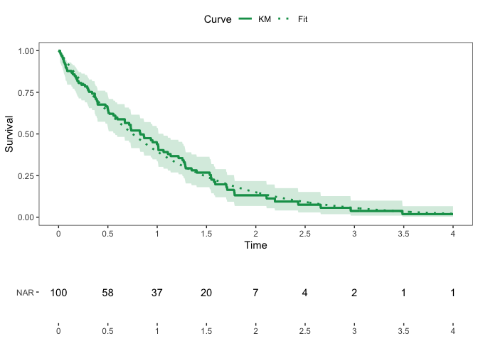
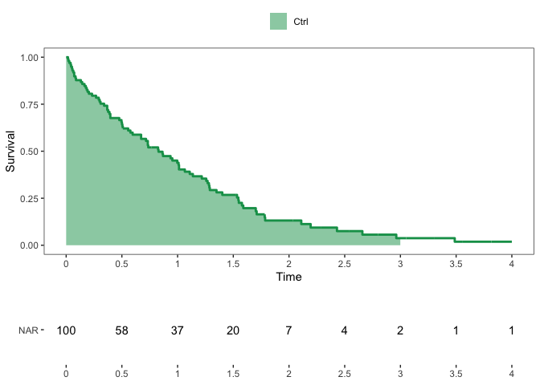
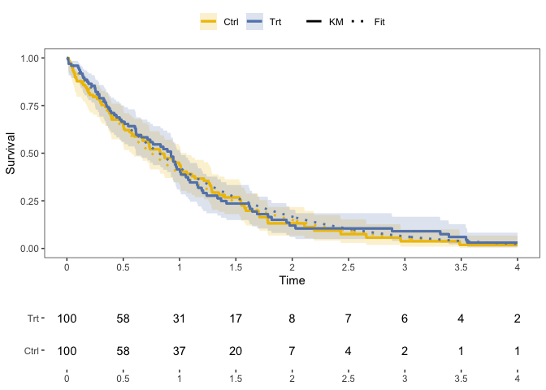

# Utility Functions for Survival Analysis

[](https://github.com/zrmacc/SurvUtils/actions/workflows/R-CMD-check.yaml)

Zachary R. McCaw <br>
Updated: 2026-02-22


``` r
suppressPackageStartupMessages({
  library(dplyr)
  library(SurvUtils)
})
```

# Installation


``` r
devtools::install_github(repo = "zrmacc/SurvUtils")
```

# Data Generation

Generates survival data with exponential event times and censoring. Optionally, the subject-specific event rate may depend on a set of covariates and/or a gamma-frailty.


``` r
data <- SurvUtils::GenData(
  base_event_rate = 1.0,
  censoring_rate = 0.25,
  n = 100,
  tau = 4.0
)
head(data)
```

```
##   idx       time status
## 1   1 0.05302913      1
## 2   2 0.15642474      1
## 3   3 0.91458726      1
## 4   4 0.18219804      1
## 5   5 2.34921502      1
## 6   6 0.13777031      1
```

# Estimation

## One Sample

### Kaplan-Meier

* Tabulates the cumulative hazard and survival functions, along with variance estimates and confidence intervals.


``` r
km_tab <- SurvUtils::TabulateKM(data)
head(km_tab)
```

```
## # A tibble: 6 × 13
##     time censor events   nar    haz cum_haz cum_haz_var cum_haz_lower
##    <dbl>  <dbl>  <dbl> <dbl>  <dbl>   <dbl>       <dbl>         <dbl>
## 1 0           0      0   100 0       0         0              0      
## 2 0.0157      0      1   100 0.01    0.01      0.0001         0.00141
## 3 0.0272      0      1    99 0.0101  0.0201    0.000202       0.00503
## 4 0.0309      1      0    98 0       0.0201    0.000202       0.00503
## 5 0.0448      1      0    97 0       0.0201    0.000202       0.00503
## 6 0.0530      0      1    96 0.0104  0.0305    0.000311       0.00984
## # ℹ 5 more variables: cum_haz_upper <dbl>, surv <dbl>, surv_var <dbl>,
## #   surv_lower <dbl>, surv_upper <dbl>
```

### Event Rate, Percentile, Restricted Mean Survival

* Calculate the event rate at a point in time.


``` r
# Rate.
SurvUtils::OneSampleRates(data, tau = 1.0)
```

```
##   tau      rate         se     lower     upper
## 1   1 0.7195301 0.04771469 0.6239354 0.8084374
```


``` r
# Percentile: median.
SurvUtils::OneSamplePercentiles(data, p = 0.5)
```

```
##   prob      time     lower     upper
## 1  0.5 0.6999805 0.4853516 0.8554904
```


``` r
# RMST.
SurvUtils::OneSampleRMST(data, tau = 1.0)
```

```
##   tau       auc         se     lower     upper
## 1   1 0.6352103 0.03437084 0.5678447 0.7025759
```

## Two Sample

### Generate Data

``` r
data0 <- SurvUtils::GenData(
  base_event_rate = 1.0,
  censoring_rate = 0.25,
  n = 100,
  tau = 4.0
)
data0$arm <- 0

data1 <- SurvUtils::GenData(
  base_event_rate = 0.5,
  censoring_rate = 0.25,
  n = 100,
  tau = 4.0
)
data1$arm <- 1
data <- rbind(data0, data1)
```

### Compare Rates

``` r
SurvUtils::CompareRates(data, tau = 1.0)
```

```
## Marginal Statistics:
##   arm tau  rate     se
## 1   0   1 0.429 0.0553
## 2   1   1 0.545 0.0528
## 
## 
## Contrasts:
##   stat   est     se  lower upper     p
## 1   rd 0.116 0.0764 -0.034 0.266 0.130
## 2   rr 1.270 0.2040  0.926 1.740 0.138
## 3   or 1.590 0.4940  0.867 2.930 0.133
```

### Compare RMSTs

``` r
SurvUtils::CompareRMSTs(data, tau = 1.0)
```

```
## Marginal Statistics:
##   tau   auc     se lower upper arm
## 1   1 0.677 0.0379 0.603 0.751   0
## 2   1 0.754 0.0342 0.687 0.821   1
## 
## 
## Contrasts:
##   stat    est     se   lower upper     p
## 1   rd 0.0773 0.0510 -0.0227 0.177 0.130
## 2   rr 1.1100 0.0802  0.9680 1.280 0.133
```

### Compare Cox Models
Compare the predictive performance of Cox models based on different sets of covariates with respect to their c-statistics on held-out data via k-fold cross validation.

``` r
# Simulate data.
n <- 1000
x1 <- rnorm(n)
x2 <- rnorm(n)
data <- SurvUtils::GenData(
  covariates = cbind(x1, x2),
  beta_event = c(1.0, -1.0),
  simple = FALSE
)

# Evaluate.
eval <- CompareCoxCstat(
  status = data$status,
  time = data$time,
  x1 = data %>% dplyr::select(x1, x2),
  x2 = data %>% dplyr::select(x1)
)

head(round(eval, digits = 3))
```

```
##   fold cstat1 cstat2  diff ratio
## 1    1  0.821  0.772 0.049 1.064
## 2    2  0.787  0.672 0.115 1.171
## 3    3  0.735  0.628 0.107 1.171
## 4    4  0.799  0.688 0.112 1.162
## 5    5  0.786  0.735 0.051 1.070
## 6    6  0.803  0.710 0.093 1.130
```

# Inference

For a tutorial on influence functions and the perturbation bootstrap, see [this vignette](https://github.com/zrmacc/SurvUtils/blob/master/vignettes/perturbation_bootstrap.pdf).

# Plotting


``` r
# Generate data.
arm1 <- SurvUtils::GenData(base_event_rate = 0.8)
arm1$arm <- 1
arm0 <- SurvUtils::GenData(base_event_rate = 1.0)
arm0$arm <- 0
data <- rbind(arm1, arm0)
```

## One Sample

### Standard Kaplan-Meier


``` r
x_breaks <- seq(from = 0.0, to = 4.0, by = 0.50)
data0 <- data %>% dplyr::filter(arm == 0)
fit0 <- Temporal::FitParaSurv(data0)  # Optional parametric fit. 
q_km <- SurvUtils::PlotOneSampleKM(data0, fit = fit0, x_breaks = x_breaks, x_max = 4)
q_nar <- SurvUtils::PlotOneSampleNARs(data0, x_breaks = x_breaks, x_max = 4)
cowplot::plot_grid(
  plotlist = list(q_km, q_nar),
  align = "v",
  axis = "l",
  ncol = 1,
  rel_heights = c(3, 1)
)
```



### AUC


``` r
x_breaks <- seq(from = 0.0, to = 4.0, by = 0.50)
data0 <- data %>% dplyr::filter(arm == 0)
q_auc <- SurvUtils::PlotOneSampleAUC(data0, x_breaks = x_breaks, x_max = 4, tau = 3)
q_nar <- SurvUtils::PlotOneSampleNARs(data0, x_breaks = x_breaks, x_max = 4)
cowplot::plot_grid(
  plotlist = list(q_auc, q_nar),
  align = "v",
  axis = "l",
  ncol = 1,
  rel_heights = c(3, 1)
)
```



## Two Sample


``` r
x_breaks <- seq(from = 0.0, to = 4.0, by = 0.50)
contrast <- Temporal::CompParaSurv(data)  # Optional parametric fit. 
q_km <- SurvUtils::PlotTwoSampleKM(data, contrast = contrast, x_breaks = x_breaks, x_max = 4)
q_nar <- SurvUtils::PlotTwoSampleNARs(data, x_breaks = x_breaks, x_max = 4)
cowplot::plot_grid(
  plotlist = list(q_km, q_nar),
  align = "v",
  axis = "l",
  ncol = 1,
  rel_heights = c(3, 1)
)
```


