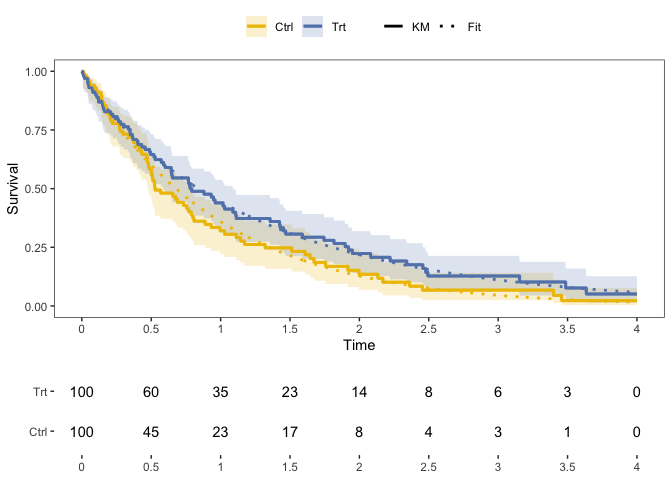

# Functions for Survival Analysis

Zachary R. McCaw <br>
Updated: 2022-03-27


```r
suppressPackageStartupMessages({
  library(dplyr)
  library(SurvUtils)
})
```

# Data Generation

Generates survival data with exponential event times and censoring. Optionally, the subject-specific event rate may depend on a set of covariates and/or a gamma-frailty.


```r
data <- SurvUtils::GenData(
  base_event_rate = 1.0,
  censoring_rate = 0.25,
  n = 100,
  tau = 4.0
)
head(data)
```

```
##   idx covariates true_event_rate frailty event_time censor_time       time
## 1   1          1               1       1 0.01594840   2.4993847 0.01594840
## 2   2          1               1       1 1.14069889   5.1421315 1.14069889
## 3   3          1               1       1 0.07534741   2.5234219 0.07534741
## 4   4          1               1       1 0.71062536   0.6288996 0.62889955
## 5   5          1               1       1 1.86053700   0.8134442 0.81344416
## 6   6          1               1       1 1.86211073  13.2284343 1.86211073
##   status
## 1      1
## 2      1
## 3      1
## 4      0
## 5      0
## 6      1
```

# Tabulate Kaplan-Meier

* Tabulates the cumulative hazard and survival functions, along with variance estimates and confidence intervals.


```r
km_tab <- SurvUtils::TabulateKM(data)
head(km_tab)
```

```
## # A tibble: 6 × 13
##      time censor events   nar    haz cum_haz cum_haz_var cum_haz_lower
##     <dbl>  <dbl>  <dbl> <dbl>  <dbl>   <dbl>       <dbl>         <dbl>
## 1 0            0      0   100 0       0         0              0      
## 2 0.00308      0      1   100 0.01    0.01      0.0001         0.00141
## 3 0.00387      1      0    99 0       0.01      0.0001         0.00141
## 4 0.0121       0      1    98 0.0102  0.0202    0.000204       0.00505
## 5 0.0159       0      1    97 0.0103  0.0305    0.000310       0.00984
## 6 0.0218       0      1    96 0.0104  0.0409    0.000419       0.0154 
## # … with 5 more variables: cum_haz_upper <dbl>, surv <dbl>, surv_var <dbl>,
## #   surv_lower <dbl>, surv_upper <dbl>
```

# Plotting


```r
# Generate data.
arm1 <- SurvUtils::GenData(base_event_rate = 0.8)
arm1$arm <- 1
arm0 <- SurvUtils::GenData(base_event_rate = 1.0)
arm0$arm <- 0
data <- rbind(arm1, arm0)
```

## One Sample

### Standard Kaplan-Meier


```r
x_breaks <- seq(from = 0.0, to = 4.0, by = 0.50)
data0 <- data %>% dplyr::filter(arm == 0)
fit0 <- Temporal::FitParaSurv(data0)
q_km <- SurvUtils::PlotOneSampleKM(data0, fit = fit0, x_breaks = x_breaks, x_max = 4)
q_nar <- SurvUtils::PlotOneSampleNARs(data0, x_breaks = x_breaks, x_max = 4)
cowplot::plot_grid(
  plotlist = list(q_km, q_nar),
  align = "v",
  axis = "l",
  ncol = 1,
  rel_heights = c(3, 1)
)
```


### AUC


```r
x_breaks <- seq(from = 0.0, to = 4.0, by = 0.50)
data0 <- data %>% dplyr::filter(arm == 0)
q_auc <- SurvUtils::PlotOneSampleAUC(data0, x_breaks = x_breaks, x_max = 4, tau = 3)
q_nar <- SurvUtils::PlotOneSampleNARs(data0, x_breaks = x_breaks, x_max = 4)
cowplot::plot_grid(
  plotlist = list(q_auc, q_nar),
  align = "v",
  axis = "l",
  ncol = 1,
  rel_heights = c(3, 1)
)
```


## Two Sample


```r
x_breaks <- seq(from = 0.0, to = 4.0, by = 0.50)
contrast <- Temporal::CompParaSurv(data)
q_km <- SurvUtils::PlotTwoSampleKM(data, contrast = contrast, x_breaks = x_breaks, x_max = 4)
q_nar <- SurvUtils::PlotTwoSampleNARs(data, x_breaks = x_breaks, x_max = 4)
cowplot::plot_grid(
  plotlist = list(q_km, q_nar),
  align = "v",
  axis = "l",
  ncol = 1,
  rel_heights = c(3, 1)
)
```


