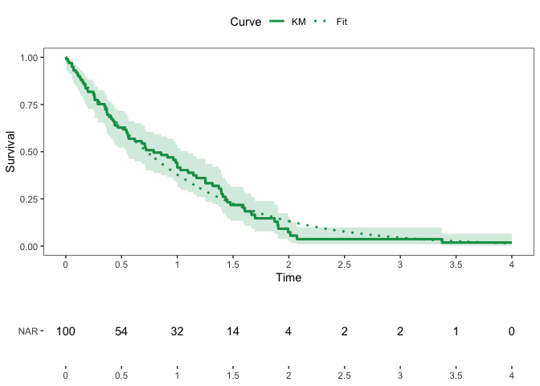
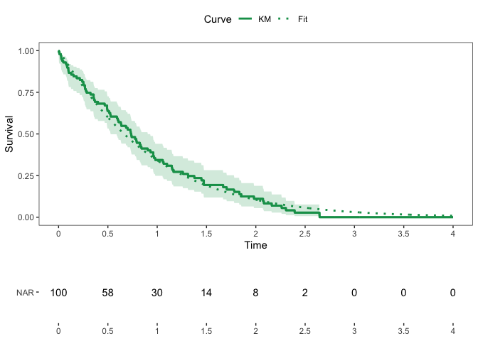

# Functions for Survival Analysis

Zachary R. McCaw <br>
Updated: 2022-10-09


```r
suppressPackageStartupMessages({
  library(dplyr)
  library(SurvUtils)
})
```

# Data Generation

Generates survival data with exponential event times and censoring. Optionally, the subject-specific event rate may depend on a set of covariates and/or a gamma-frailty.


```r
data <- SurvUtils::GenData(
  base_event_rate = 1.0,
  censoring_rate = 0.25,
  n = 100,
  tau = 4.0
)
head(data)
```

```
##   idx covariates true_event_rate frailty event_time censor_time      time
## 1   1          1               1       1  1.3381785   0.1358120 0.1358120
## 2   2          1               1       1  1.3415662   6.2325090 1.3415662
## 3   3          1               1       1  0.2917765  14.2090314 0.2917765
## 4   4          1               1       1  0.5734920   0.2855799 0.2855799
## 5   5          1               1       1  0.8485916   6.1223100 0.8485916
## 6   6          1               1       1  0.2768621   3.3442509 0.2768621
##   status
## 1      0
## 2      1
## 3      1
## 4      0
## 5      1
## 6      1
```

# Estimation

## One Sample

### Kaplan-Meier

* Tabulates the cumulative hazard and survival functions, along with variance estimates and confidence intervals.


```r
km_tab <- SurvUtils::TabulateKM(data)
head(km_tab)
```

```
## # A tibble: 6 × 13
##      time censor events   nar    haz cum_haz cum_haz_var cum_haz…¹ cum_h…²  surv
##     <dbl>  <dbl>  <dbl> <dbl>  <dbl>   <dbl>       <dbl>     <dbl>   <dbl> <dbl>
## 1 0            0      0   100 0       0         0          0        0       1   
## 2 0.00355      0      1   100 0.01    0.01      0.0001     0.00141  0.0710  0.99
## 3 0.0221       0      1    99 0.0101  0.0201    0.000202   0.00503  0.0804  0.98
## 4 0.0329       0      1    98 0.0102  0.0303    0.000306   0.00977  0.0940  0.97
## 5 0.0393       0      1    97 0.0103  0.0406    0.000412   0.0152   0.108   0.96
## 6 0.0403       0      1    96 0.0104  0.0510    0.000521   0.0212   0.123   0.95
## # … with 3 more variables: surv_var <dbl>, surv_lower <dbl>, surv_upper <dbl>,
## #   and abbreviated variable names ¹​cum_haz_lower, ²​cum_haz_upper
```

### Event Rate, Percentile, Restricted Mean Survival

* Calculate the event rate at a point in time.


```r
# Rate.
SurvUtils::OneSampleRates(data, tau = 1.0)
```

```
##   tau      rate        se     lower     upper
## 1   1 0.3572734 0.0500913 0.2607411 0.4547153
```


```r
# Percentile: median.
SurvUtils::OneSamplePercentiles(data, p = 0.5)
```

```
##   prob      time     lower     upper
## 1  0.5 0.6022287 0.4283836 0.8523196
```


```r
# RMST.
SurvUtils::OneSampleRMST(data, tau = 1.0)
```

```
##   tau       auc         se     lower    upper
## 1   1 0.5962124 0.03759794 0.5225218 0.669903
```

## Two Sample

### Generate Data

```r
data0 <- SurvUtils::GenData(
  base_event_rate = 1.0,
  censoring_rate = 0.25,
  n = 100,
  tau = 4.0
)
data0$arm <- 0

data1 <- SurvUtils::GenData(
  base_event_rate = 0.5,
  censoring_rate = 0.25,
  n = 100,
  tau = 4.0
)
data1$arm <- 1
data <- rbind(data0, data1)
```

### Compare Rates

```r
SurvUtils::CompareRates(data, tau = 1.0)
```

```
## Marginal Statistics:
##   arm tau  rate     se
## 1   0   1 0.408 0.0514
## 2   1   1 0.591 0.0531
## 
## 
## Contrasts:
##   stat   est     se lower upper      p
## 1   rd 0.184 0.0739 0.039 0.329 0.0129
## 2   rr 1.450 0.2250 1.070 1.970 0.0162
## 3   or 2.100 0.6440 1.150 3.830 0.0151
```


```r
SurvUtils::CompareRMSTs(data, tau = 1.0)
```

```
## Marginal Statistics:
##   tau   auc     se lower upper arm
## 1   1 0.618 0.0381 0.543 0.693   0
## 2   1 0.752 0.0347 0.684 0.820   1
## 
## 
## Contrasts:
##   stat   est     se  lower upper       p
## 1   rd 0.134 0.0515 0.0333 0.235 0.00916
## 2   rr 1.220 0.0937 1.0500 1.420 0.01060
```

# Plotting


```r
# Generate data.
arm1 <- SurvUtils::GenData(base_event_rate = 0.8)
arm1$arm <- 1
arm0 <- SurvUtils::GenData(base_event_rate = 1.0)
arm0$arm <- 0
data <- rbind(arm1, arm0)
```

## One Sample

### Standard Kaplan-Meier


```r
x_breaks <- seq(from = 0.0, to = 4.0, by = 0.50)
data0 <- data %>% dplyr::filter(arm == 0)
fit0 <- Temporal::FitParaSurv(data0)
q_km <- SurvUtils::PlotOneSampleKM(data0, fit = fit0, x_breaks = x_breaks, x_max = 4)
q_nar <- SurvUtils::PlotOneSampleNARs(data0, x_breaks = x_breaks, x_max = 4)
cowplot::plot_grid(
  plotlist = list(q_km, q_nar),
  align = "v",
  axis = "l",
  ncol = 1,
  rel_heights = c(3, 1)
)
```


### AUC


```r
x_breaks <- seq(from = 0.0, to = 4.0, by = 0.50)
data0 <- data %>% dplyr::filter(arm == 0)
q_auc <- SurvUtils::PlotOneSampleAUC(data0, x_breaks = x_breaks, x_max = 4, tau = 3)
q_nar <- SurvUtils::PlotOneSampleNARs(data0, x_breaks = x_breaks, x_max = 4)
cowplot::plot_grid(
  plotlist = list(q_auc, q_nar),
  align = "v",
  axis = "l",
  ncol = 1,
  rel_heights = c(3, 1)
)
```



## Two Sample


```r
x_breaks <- seq(from = 0.0, to = 4.0, by = 0.50)
contrast <- Temporal::CompParaSurv(data)
q_km <- SurvUtils::PlotTwoSampleKM(data, contrast = contrast, x_breaks = x_breaks, x_max = 4)
q_nar <- SurvUtils::PlotTwoSampleNARs(data, x_breaks = x_breaks, x_max = 4)
cowplot::plot_grid(
  plotlist = list(q_km, q_nar),
  align = "v",
  axis = "l",
  ncol = 1,
  rel_heights = c(3, 1)
)
```


