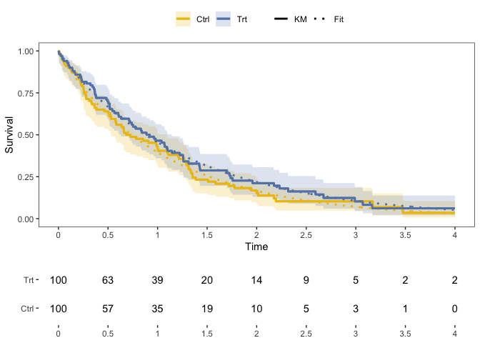

# Functions for Survival Analysis

Zachary R. McCaw <br>
Updated: 2023-09-26


```r
suppressPackageStartupMessages({
  library(dplyr)
  library(SurvUtils)
})
```

# Installation


```r
devtools::install_github(repo = "zrmacc/SurvUtils")
```

# Data Generation

Generates survival data with exponential event times and censoring. Optionally, the subject-specific event rate may depend on a set of covariates and/or a gamma-frailty.


```r
data <- SurvUtils::GenData(
  base_event_rate = 1.0,
  censoring_rate = 0.25,
  n = 100,
  tau = 4.0
)
head(data)
```

```
##   idx covariates true_event_rate frailty event_time censor_time      time
## 1   1          1               1       1  0.1929490   12.045222 0.1929490
## 2   2          1               1       1  0.9656786    1.787139 0.9656786
## 3   3          1               1       1  1.1028924    2.113933 1.1028924
## 4   4          1               1       1  0.3156063    3.215533 0.3156063
## 5   5          1               1       1  0.5373122    9.298407 0.5373122
## 6   6          1               1       1  0.6273305    3.305614 0.6273305
##   status
## 1      1
## 2      1
## 3      1
## 4      1
## 5      1
## 6      1
```

# Estimation

## One Sample

### Kaplan-Meier

* Tabulates the cumulative hazard and survival functions, along with variance estimates and confidence intervals.


```r
km_tab <- SurvUtils::TabulateKM(data)
head(km_tab)
```

```
## # A tibble: 6 × 13
##     time censor events   nar    haz cum_haz cum_haz_var cum_haz_lower
##    <dbl>  <dbl>  <dbl> <dbl>  <dbl>   <dbl>       <dbl>         <dbl>
## 1 0           0      0   100 0       0         0              0      
## 2 0.0232      1      0   100 0       0         0              0      
## 3 0.0291      0      1    99 0.0101  0.0101    0.000102       0.00142
## 4 0.0303      0      1    98 0.0102  0.0203    0.000206       0.00508
## 5 0.0334      0      1    97 0.0103  0.0306    0.000312       0.00987
## 6 0.0370      1      0    96 0       0.0306    0.000312       0.00987
## # ℹ 5 more variables: cum_haz_upper <dbl>, surv <dbl>, surv_var <dbl>,
## #   surv_lower <dbl>, surv_upper <dbl>
```

#### Influence function

The influence function expansion of the Kaplan-Meier estimator is:

$$
\sqrt{n}\big\{ \hat{S}(t) - S(t) \big\} = \frac{1}{\sqrt{n}}\sum_{i=1}^{n}\psi_{i}(t) + o_{p}(1)
$$
where:

$$
\psi_{i}(t) = -S(t) \int_{0}^{t}\frac{dM_{i}(u)}{n^{-1} Y(u)}
$$
and $dM_{i}$ is the counting-process martingale:

$$
dM_{i}(u) = dN_{i}(u) - Y_{i}(u)dH(u)
$$


```r
n <- 1000
data <- GenData(n = n)
tau <- 1.0

# Influence function calculation.
influence <- KMInfluence(data, tau = tau)

# Estimated variance of the KM estimator at time tau.
inf_var <- mean(influence^2) / n
inf_se <- sqrt(inf_var)
print(round(inf_se, digits = 4))
```

```
## [1] 0.0165
```

### Event Rate, Percentile, Restricted Mean Survival

* Calculate the event rate at a point in time.


```r
# Rate.
SurvUtils::OneSampleRates(data, tau = 1.0)
```

```
##   tau      rate         se     lower     upper
## 1   1 0.3854347 0.01651116 0.3530477 0.4176908
```


```r
# Percentile: median.
SurvUtils::OneSamplePercentiles(data, p = 0.5)
```

```
##   prob      time     lower     upper
## 1  0.5 0.6856511 0.6233689 0.7571287
```


```r
# RMST.
SurvUtils::OneSampleRMST(data, tau = 1.0)
```

```
##   tau       auc         se     lower     upper
## 1   1 0.6323892 0.01165791 0.6095401 0.6552382
```

## Two Sample

### Generate Data

```r
data0 <- SurvUtils::GenData(
  base_event_rate = 1.0,
  censoring_rate = 0.25,
  n = 100,
  tau = 4.0
)
data0$arm <- 0

data1 <- SurvUtils::GenData(
  base_event_rate = 0.5,
  censoring_rate = 0.25,
  n = 100,
  tau = 4.0
)
data1$arm <- 1
data <- rbind(data0, data1)
```

### Compare Rates

```r
SurvUtils::CompareRates(data, tau = 1.0)
```

```
## Marginal Statistics:
##   arm tau  rate     se
## 1   0   1 0.426 0.0524
## 2   1   1 0.649 0.0531
## 
## 
## Contrasts:
##   stat   est     se  lower upper       p
## 1   rd 0.223 0.0746 0.0766 0.369 0.00282
## 2   rr 1.520 0.2250 1.1400 2.040 0.00441
## 3   or 2.490 0.7880 1.3400 4.630 0.00396
```

### Compare RMSTs

```r
SurvUtils::CompareRMSTs(data, tau = 1.0)
```

```
## Marginal Statistics:
##   tau   auc     se lower upper arm
## 1   1 0.618 0.0367 0.547 0.690   0
## 2   1 0.842 0.0287 0.785 0.898   1
## 
## 
## Contrasts:
##   stat   est     se lower upper        p
## 1   rd 0.223 0.0466 0.132 0.315 1.63e-06
## 2   rr 1.360 0.0931 1.190 1.560 6.59e-06
```

### Compare Cox Models
Compare the predictive performance of Cox models based on different sets of covariates with respect to their c-statistics on held-out data via k-fold cross validation.

```r
# Simulate data.
n <- 1000
x1 <- rnorm(n)
x2 <- rnorm(n)
data <- SurvUtils::GenData(
  covariates = cbind(x1, x2),
  beta_event = c(1.0, -1.0)
)

# Evaluate.
eval <- CompreCoxCstat(
  status = data$status,
  time = data$time,
  x1 = data %>% dplyr::select(x1, x2),
  x2 = data %>% dplyr::select(x1)
)

head(round(eval, digits = 3))
```

```
##   fold cstat1 cstat2  diff ratio
## 1    1  0.790  0.714 0.076 1.107
## 2    2  0.795  0.734 0.061 1.084
## 3    3  0.777  0.626 0.151 1.241
## 4    4  0.788  0.630 0.158 1.250
## 5    5  0.813  0.687 0.126 1.184
## 6    6  0.803  0.698 0.104 1.149
```

# Plotting


```r
# Generate data.
arm1 <- SurvUtils::GenData(base_event_rate = 0.8)
arm1$arm <- 1
arm0 <- SurvUtils::GenData(base_event_rate = 1.0)
arm0$arm <- 0
data <- rbind(arm1, arm0)
```

## One Sample

### Standard Kaplan-Meier


```r
x_breaks <- seq(from = 0.0, to = 4.0, by = 0.50)
data0 <- data %>% dplyr::filter(arm == 0)
fit0 <- Temporal::FitParaSurv(data0)  # Optional parametric fit. 
q_km <- SurvUtils::PlotOneSampleKM(data0, fit = fit0, x_breaks = x_breaks, x_max = 4)
q_nar <- SurvUtils::PlotOneSampleNARs(data0, x_breaks = x_breaks, x_max = 4)
cowplot::plot_grid(
  plotlist = list(q_km, q_nar),
  align = "v",
  axis = "l",
  ncol = 1,
  rel_heights = c(3, 1)
)
```


### AUC


```r
x_breaks <- seq(from = 0.0, to = 4.0, by = 0.50)
data0 <- data %>% dplyr::filter(arm == 0)
q_auc <- SurvUtils::PlotOneSampleAUC(data0, x_breaks = x_breaks, x_max = 4, tau = 3)
q_nar <- SurvUtils::PlotOneSampleNARs(data0, x_breaks = x_breaks, x_max = 4)
cowplot::plot_grid(
  plotlist = list(q_auc, q_nar),
  align = "v",
  axis = "l",
  ncol = 1,
  rel_heights = c(3, 1)
)
```


## Two Sample


```r
x_breaks <- seq(from = 0.0, to = 4.0, by = 0.50)
contrast <- Temporal::CompParaSurv(data)  # Optional parametric fit. 
q_km <- SurvUtils::PlotTwoSampleKM(data, contrast = contrast, x_breaks = x_breaks, x_max = 4)
q_nar <- SurvUtils::PlotTwoSampleNARs(data, x_breaks = x_breaks, x_max = 4)
cowplot::plot_grid(
  plotlist = list(q_km, q_nar),
  align = "v",
  axis = "l",
  ncol = 1,
  rel_heights = c(3, 1)
)
```


