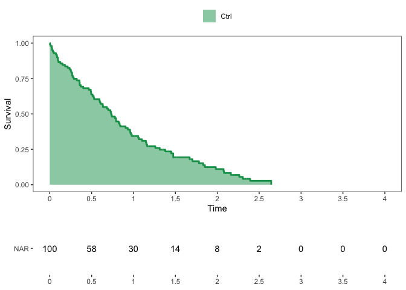

# Utility Functions for Survival Analysis

Zachary R. McCaw <br>
Updated: 2024-08-04


```r
suppressPackageStartupMessages({
  library(dplyr)
  library(SurvUtils)
})
```

# Installation


```r
devtools::install_github(repo = "zrmacc/SurvUtils")
```

# Data Generation

Generates survival data with exponential event times and censoring. Optionally, the subject-specific event rate may depend on a set of covariates and/or a gamma-frailty.


```r
data <- SurvUtils::GenData(
  base_event_rate = 1.0,
  censoring_rate = 0.25,
  n = 100,
  tau = 4.0
)
head(data)
```

```
##   idx        time status
## 1   1 0.647678901      1
## 2   2 0.007453288      1
## 3   3 0.425188254      1
## 4   4 1.640308589      1
## 5   5 0.060364399      1
## 6   6 0.180278373      1
```

# Estimation

## One Sample

### Kaplan-Meier

* Tabulates the cumulative hazard and survival functions, along with variance estimates and confidence intervals.


```r
km_tab <- SurvUtils::TabulateKM(data)
head(km_tab)
```

```
## # A tibble: 6 × 13
##        time censor events   nar    haz cum_haz cum_haz_var cum_haz_lower
##       <dbl>  <dbl>  <dbl> <dbl>  <dbl>   <dbl>       <dbl>         <dbl>
## 1 0              0      0   100 0       0         0              0      
## 2 0.0000786      0      1   100 0.01    0.01      0.0001         0.00141
## 3 0.00442        1      0    99 0       0.01      0.0001         0.00141
## 4 0.00745        0      1    98 0.0102  0.0202    0.000204       0.00505
## 5 0.0169         0      1    97 0.0103  0.0305    0.000310       0.00984
## 6 0.0220         0      1    96 0.0104  0.0409    0.000419       0.0154 
## # ℹ 5 more variables: cum_haz_upper <dbl>, surv <dbl>, surv_var <dbl>,
## #   surv_lower <dbl>, surv_upper <dbl>
```

### Event Rate, Percentile, Restricted Mean Survival

* Calculate the event rate at a point in time.


```r
# Rate.
SurvUtils::OneSampleRates(data, tau = 1.0)
```

```
##   tau      rate        se     lower     upper
## 1   1 0.3462829 0.0492781 0.2516968 0.4425296
```


```r
# Percentile: median.
SurvUtils::OneSamplePercentiles(data, p = 0.5)
```

```
##   prob      time     lower     upper
## 1  0.5 0.6742626 0.4251883 0.7910864
```


```r
# RMST.
SurvUtils::OneSampleRMST(data, tau = 1.0)
```

```
##   tau       auc         se     lower    upper
## 1   1 0.5986377 0.03840798 0.5233595 0.673916
```

## Two Sample

### Generate Data

```r
data0 <- SurvUtils::GenData(
  base_event_rate = 1.0,
  censoring_rate = 0.25,
  n = 100,
  tau = 4.0
)
data0$arm <- 0

data1 <- SurvUtils::GenData(
  base_event_rate = 0.5,
  censoring_rate = 0.25,
  n = 100,
  tau = 4.0
)
data1$arm <- 1
data <- rbind(data0, data1)
```

### Compare Rates

```r
SurvUtils::CompareRates(data, tau = 1.0)
```

```
## Marginal Statistics:
##   arm tau  rate     se
## 1   0   1 0.358 0.0496
## 2   1   1 0.597 0.0531
## 
## 
## Contrasts:
##   stat   est     se  lower upper        p
## 1   rd 0.239 0.0726 0.0968 0.382 0.000993
## 2   rr 1.670 0.2740 1.2100 2.300 0.001880
## 3   or 2.660 0.8200 1.4500 4.870 0.001530
```

### Compare RMSTs

```r
SurvUtils::CompareRMSTs(data, tau = 1.0)
```

```
## Marginal Statistics:
##   tau   auc     se lower upper arm
## 1   1 0.579 0.0386 0.503 0.655   0
## 2   1 0.803 0.0308 0.742 0.863   1
## 
## 
## Contrasts:
##   stat   est     se lower upper        p
## 1   rd 0.224 0.0494 0.127  0.32 6.04e-06
## 2   rr 1.390 0.1070 1.190  1.61 2.22e-05
```

### Compare Cox Models
Compare the predictive performance of Cox models based on different sets of covariates with respect to their c-statistics on held-out data via k-fold cross validation.

```r
# Simulate data.
n <- 1000
x1 <- rnorm(n)
x2 <- rnorm(n)
data <- SurvUtils::GenData(
  covariates = cbind(x1, x2),
  beta_event = c(1.0, -1.0),
  simple = FALSE
)

# Evaluate.
eval <- CompreCoxCstat(
  status = data$status,
  time = data$time,
  x1 = data %>% dplyr::select(x1, x2),
  x2 = data %>% dplyr::select(x1)
)

head(round(eval, digits = 3))
```

```
##   fold cstat1 cstat2  diff ratio
## 1    1  0.812  0.735 0.077 1.104
## 2    2  0.801  0.703 0.097 1.138
## 3    3  0.784  0.654 0.130 1.199
## 4    4  0.744  0.633 0.112 1.176
## 5    5  0.724  0.654 0.070 1.108
## 6    6  0.737  0.679 0.058 1.086
```

# Inference

For a tutorial on influence functions and the perturbation bootstrap, see [this vignette](https://github.com/zrmacc/SurvUtils/blob/master/vignettes/perturbation_bootstrap.pdf).

# Plotting


```r
# Generate data.
arm1 <- SurvUtils::GenData(base_event_rate = 0.8)
arm1$arm <- 1
arm0 <- SurvUtils::GenData(base_event_rate = 1.0)
arm0$arm <- 0
data <- rbind(arm1, arm0)
```

## One Sample

### Standard Kaplan-Meier


```r
x_breaks <- seq(from = 0.0, to = 4.0, by = 0.50)
data0 <- data %>% dplyr::filter(arm == 0)
fit0 <- Temporal::FitParaSurv(data0)  # Optional parametric fit. 
q_km <- SurvUtils::PlotOneSampleKM(data0, fit = fit0, x_breaks = x_breaks, x_max = 4)
q_nar <- SurvUtils::PlotOneSampleNARs(data0, x_breaks = x_breaks, x_max = 4)
cowplot::plot_grid(
  plotlist = list(q_km, q_nar),
  align = "v",
  axis = "l",
  ncol = 1,
  rel_heights = c(3, 1)
)
```


### AUC


```r
x_breaks <- seq(from = 0.0, to = 4.0, by = 0.50)
data0 <- data %>% dplyr::filter(arm == 0)
q_auc <- SurvUtils::PlotOneSampleAUC(data0, x_breaks = x_breaks, x_max = 4, tau = 3)
q_nar <- SurvUtils::PlotOneSampleNARs(data0, x_breaks = x_breaks, x_max = 4)
cowplot::plot_grid(
  plotlist = list(q_auc, q_nar),
  align = "v",
  axis = "l",
  ncol = 1,
  rel_heights = c(3, 1)
)
```



## Two Sample


```r
x_breaks <- seq(from = 0.0, to = 4.0, by = 0.50)
contrast <- Temporal::CompParaSurv(data)  # Optional parametric fit. 
q_km <- SurvUtils::PlotTwoSampleKM(data, contrast = contrast, x_breaks = x_breaks, x_max = 4)
q_nar <- SurvUtils::PlotTwoSampleNARs(data, x_breaks = x_breaks, x_max = 4)
cowplot::plot_grid(
  plotlist = list(q_km, q_nar),
  align = "v",
  axis = "l",
  ncol = 1,
  rel_heights = c(3, 1)
)
```


